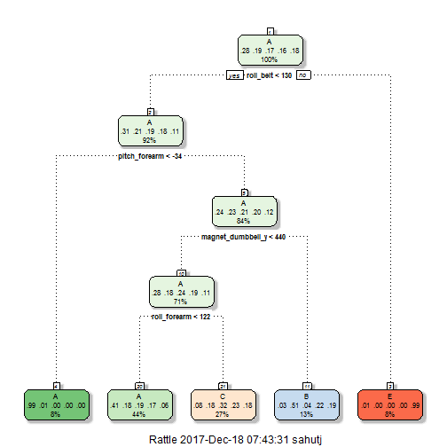

# Setup

## background 
One thing that people regularly do is quantify how much of a particular activity they do, but they rarely quantify how well they do it. In this project, we use data from accelerometers on the belt, forearm, arm, and dumbell of 6 participants to predict the manner in which they did the exercise. 

Participants were asked to perform barbell lifts correctly and incorrectly in 5 different ways - this is the _classe_ variable in our data set. 

More information is available from the website here: http://web.archive.org/web/20161224072740/http:/groupware.les.inf.puc-rio.br/har


## Initial download, "raw" data 
The training data for this project are available here:
https://d396qusza40orc.cloudfront.net/predmachlearn/pml-training.csv

The test data are available here:
https://d396qusza40orc.cloudfront.net/predmachlearn/pml-testing.csv


## Removing unnecessary predictors from the data

The raw training and test sets contain 159 potential predictors.  Many of the variables contain very little data or have very little variance and will not contribute anything to the model.  And a few (labeled "weird" in the code) seemed inappropriate to include, having to do with timestamps and the mysterious variable, "X."

In this step, 106 variables were removed from consideration: 100 were removed because they were more than 90% empty, 1 variable not already identified have near zero variance, and the remaining 5 were "weird."  Only 53 potential predictors were left. 


```r
unique(as.character(FeatureNames$FullNames[1:53]))
```

```
##  [1] "user_name"            "roll_belt"            "pitch_belt"          
##  [4] "yaw_belt"             "total_accel_belt"     "gyros_belt_x"        
##  [7] "gyros_belt_y"         "gyros_belt_z"         "accel_belt_x"        
## [10] "accel_belt_y"         "accel_belt_z"         "magnet_belt_x"       
## [13] "magnet_belt_y"        "magnet_belt_z"        "roll_arm"            
## [16] "pitch_arm"            "yaw_arm"              "total_accel_arm"     
## [19] "gyros_arm_x"          "gyros_arm_y"          "gyros_arm_z"         
## [22] "accel_arm_x"          "accel_arm_y"          "accel_arm_z"         
## [25] "magnet_arm_x"         "magnet_arm_y"         "magnet_arm_z"        
## [28] "roll_dumbbell"        "pitch_dumbbell"       "yaw_dumbbell"        
## [31] "total_accel_dumbbell" "gyros_dumbbell_x"     "gyros_dumbbell_y"    
## [34] "gyros_dumbbell_z"     "accel_dumbbell_x"     "accel_dumbbell_y"    
## [37] "accel_dumbbell_z"     "magnet_dumbbell_x"    "magnet_dumbbell_y"   
## [40] "magnet_dumbbell_z"    "roll_forearm"         "pitch_forearm"       
## [43] "yaw_forearm"          "total_accel_forearm"  "gyros_forearm_x"     
## [46] "gyros_forearm_y"      "gyros_forearm_z"      "accel_forearm_x"     
## [49] "accel_forearm_y"      "accel_forearm_z"      "magnet_forearm_x"    
## [52] "magnet_forearm_y"     "magnet_forearm_z"
```

## Setting part of training data aside for intermediate evaluation

The raw training data set was huge: it had 19622 rows.  Since we wanted to evaluate several modeling methods and there was plenty of data to spare, we set aside 40% of the data for model evaluation.  This evaluation data set is labeled test_pre, since it is used as a test set for model evaluation, but is NOT the final test set.  The final test set is labeld test_final.

## Exploratory analysis

Feature Plots were used to see any potential relationships between the predictors and classe.  It seemed that the belt-based measurements seemed to seperate the classes a bit  and it was clear that many predictors were correlated with eachother.


# Training the data

## Model 1:  Classification tree

The data were first modeled with a single classification tree, using method="rpart".  This model ran quickly, but the accuracy was only 49.92% when evaluated on the test_pre set.  

```r
#MODEL STATEMENT
modFit_classTree <- train(classe ~ .,method="rpart",data=training)
```


```r
predictions_classTree<-predict(modFit_classTree,newdata=testing_pre)
confusionMatrix(predictions_classTree,testing_pre$classe)
```

```
## Confusion Matrix and Statistics
## 
##           Reference
## Prediction    A    B    C    D    E
##          A 2042  654  622  578  192
##          B   31  500   45  223  196
##          C  151  364  701  485  380
##          D    0    0    0    0    0
##          E    8    0    0    0  674
## 
## Overall Statistics
##                                           
##                Accuracy : 0.4992          
##                  95% CI : (0.4881, 0.5104)
##     No Information Rate : 0.2845          
##     P-Value [Acc > NIR] : < 2.2e-16       
##                                           
##                   Kappa : 0.3454          
##  Mcnemar's Test P-Value : NA              
## 
## Statistics by Class:
## 
##                      Class: A Class: B Class: C Class: D Class: E
## Sensitivity            0.9149  0.32938  0.51243   0.0000  0.46741
## Specificity            0.6356  0.92178  0.78697   1.0000  0.99875
## Pos Pred Value         0.4995  0.50251  0.33686      NaN  0.98827
## Neg Pred Value         0.9494  0.85141  0.88430   0.8361  0.89280
## Prevalence             0.2845  0.19347  0.17436   0.1639  0.18379
## Detection Rate         0.2603  0.06373  0.08934   0.0000  0.08590
## Detection Prevalence   0.5210  0.12682  0.26523   0.0000  0.08692
## Balanced Accuracy      0.7752  0.62558  0.64970   0.5000  0.73308
```

It was interesting, however, to see how the data were split at this step.  The first variable to split on was roll_belt which gave a very good prediction of whether the classe was in level "E."  After roll_belt, pitch_forearm was selected, then magnet_dumbbell_y and finally roll_forearm.  


```r
fancyRpartPlot(modFit_classTree$finalModel)
```




## Model 2:  Random Forest 

The data were then modeled with a random forest, using method="rf" and all default parameters.  This model took hours to run, but the accuracy was 99.41% when evaluated on the test_pre set.  The accuracy was truly amazing, but the solution didn't seem scalable.  It seems unacceptable to have to wait hours for the result.  

```r
#MODEL STATEMENT
modFit_classTree <- train(classe ~ .,method="rf",data=training)
```


```r
predictions_rf<-predict(modFit_rf,newdata=testing_pre)
confusionMatrix(predictions_rf,testing_pre$classe)
```

```
## Confusion Matrix and Statistics
## 
##           Reference
## Prediction    A    B    C    D    E
##          A 2227   13    0    0    2
##          B    2 1498    7    1    0
##          C    1    7 1354   26    3
##          D    0    0    7 1259    7
##          E    2    0    0    0 1430
## 
## Overall Statistics
##                                           
##                Accuracy : 0.9901          
##                  95% CI : (0.9876, 0.9921)
##     No Information Rate : 0.2845          
##     P-Value [Acc > NIR] : < 2.2e-16       
##                                           
##                   Kappa : 0.9874          
##  Mcnemar's Test P-Value : NA              
## 
## Statistics by Class:
## 
##                      Class: A Class: B Class: C Class: D Class: E
## Sensitivity            0.9978   0.9868   0.9898   0.9790   0.9917
## Specificity            0.9973   0.9984   0.9943   0.9979   0.9997
## Pos Pred Value         0.9933   0.9934   0.9734   0.9890   0.9986
## Neg Pred Value         0.9991   0.9968   0.9978   0.9959   0.9981
## Prevalence             0.2845   0.1935   0.1744   0.1639   0.1838
## Detection Rate         0.2838   0.1909   0.1726   0.1605   0.1823
## Detection Prevalence   0.2858   0.1922   0.1773   0.1622   0.1825
## Balanced Accuracy      0.9975   0.9926   0.9920   0.9884   0.9957
```

Similary to the first classification tree, it was interesting to see the relative imporantance assigned to each predictor as part of the random forest procedure.  Roll_belt was again given primary importance, and again it was followed by pitch_forearm.  Then yaw_belt, magnet_dumbbell_z, magnet_dumbbell_y, pitch_belt, and roll_forearm.  After this the relative imporance scores drop quickly. 


```r
varImp_rf%>% arrange(desc(Overall))
```

```
##       Overall                  var
## 1  1186.91796            roll_belt
## 2   720.52739        pitch_forearm
## 3   655.63448             yaw_belt
## 4   562.79189    magnet_dumbbell_z
## 5   554.97109    magnet_dumbbell_y
## 6   553.93842           pitch_belt
## 7   490.01700         roll_forearm
## 8   282.67217     accel_dumbbell_y
## 9   248.37166        roll_dumbbell
## 10  237.07769      accel_forearm_x
## 11  224.34822    magnet_dumbbell_x
## 12  200.46020        magnet_belt_z
## 13  198.37092     accel_dumbbell_z
## 14  185.47725        magnet_belt_y
## 15  176.56661     magnet_forearm_z
## 16  174.54178 total_accel_dumbbell
## 17  174.04773         accel_belt_z
## 18  155.49081         gyros_belt_z
## 19  144.85463              yaw_arm
## 20  132.41550        magnet_belt_x
## 21  114.53795             roll_arm
## 22  111.76269         yaw_dumbbell
## 23  108.83538          accel_arm_x
## 24  108.20085     gyros_dumbbell_y
## 25  106.24879      accel_forearm_z
## 26   91.26721     magnet_forearm_x
## 27   89.71165         magnet_arm_y
## 28   89.60874         magnet_arm_x
## 29   88.59216     magnet_forearm_y
## 30   83.30470     accel_dumbbell_x
## 31   82.89334          yaw_forearm
## 32   78.65928         magnet_arm_z
## 33   75.41452            pitch_arm
## 34   64.43934          gyros_arm_y
## 35   60.47871          accel_arm_y
## 36   58.22951       pitch_dumbbell
## 37   57.17408      accel_forearm_y
## 38   56.64163     gyros_dumbbell_x
## 39   51.81919      gyros_forearm_y
## 40   50.38281          gyros_arm_x
## 41   44.33929          accel_arm_z
## 42   41.50179     total_accel_belt
## 43   41.05184  total_accel_forearm
## 44   39.72227         gyros_belt_y
## 45   39.57163      total_accel_arm
## 46   37.75244     gyros_dumbbell_z
## 47   37.52005         gyros_belt_x
## 48   33.85784      gyros_forearm_z
## 49   33.14784         accel_belt_y
## 50   29.97800         accel_belt_x
## 51   25.08268      gyros_forearm_x
## 52   18.70523          gyros_arm_z
```

## Model 3:  Random Forest using only variables with "high imporance"

In this step, the data were modeled with a random forest, but only using the most important 7 predictors identified above.  This model took around 5 minutes to run, and the accuracy was 98.04% when evaluated on the test_pre set.  This seemed to be the best tradeoff of accuracy and scalability so it was selected as the final model.

```r
#MODEL STATEMENT
modFit_rf_iv <- train(
    classe ~ roll_belt + pitch_belt + yaw_belt + magnet_dumbbell_y + 
            magnet_dumbbell_z + roll_forearm + pitch_forearm
    ,method="rf"
    ,data=training)
```


```r
predictions_rf_iv<-predict(modFit_rf_iv,newdata=testing_pre)
confusionMatrix(predictions_rf_iv,testing_pre$classe)
```

```
## Confusion Matrix and Statistics
## 
##           Reference
## Prediction    A    B    C    D    E
##          A 2221    6    1    0    0
##          B    2 1502    1    2    5
##          C    8   10 1363    3    1
##          D    1    0    3 1281    1
##          E    0    0    0    0 1435
## 
## Overall Statistics
##                                           
##                Accuracy : 0.9944          
##                  95% CI : (0.9925, 0.9959)
##     No Information Rate : 0.2845          
##     P-Value [Acc > NIR] : < 2.2e-16       
##                                           
##                   Kappa : 0.9929          
##  Mcnemar's Test P-Value : NA              
## 
## Statistics by Class:
## 
##                      Class: A Class: B Class: C Class: D Class: E
## Sensitivity            0.9951   0.9895   0.9963   0.9961   0.9951
## Specificity            0.9988   0.9984   0.9966   0.9992   1.0000
## Pos Pred Value         0.9969   0.9934   0.9841   0.9961   1.0000
## Neg Pred Value         0.9980   0.9975   0.9992   0.9992   0.9989
## Prevalence             0.2845   0.1935   0.1744   0.1639   0.1838
## Detection Rate         0.2831   0.1914   0.1737   0.1633   0.1829
## Detection Prevalence   0.2840   0.1927   0.1765   0.1639   0.1829
## Balanced Accuracy      0.9969   0.9939   0.9965   0.9977   0.9976
```


## Model 4:  Random Forest using top 10 Principal Componants

Although model 3 already seemed like the winner, we cannot ignore the fact that many of the predictors were highly correlated.  The prcomp function showed that the top 10 Principal Componants were sufficient to represent the 96% of the variability in the 53 predictors.  So in this final step, the data were modeled with a random forest, but class was modeled on the first 10 PC vectors. 

Like the original random forest, this model took hours to run.  And the accuracy was 94.89% when evaluated on the test_pre set.  This solution was less accurate and less scalable than the model using the top 7 important predictors!  

```r
#PREPROCESSING
preProc <- preProcess(training_numeric,method="pca",pcaComp=10) #same as prcomp function but with scale=T
training_PCs <- predict(object=preProc,newdata=training_numeric)
training_PCs$classe<-training$classe

#MODEL STATEMENT
modFit_rf_PC <- train(classe ~ .,method="rf",data=training_PCs, prox = T)
```


```r
predictions_rf_PC<-predict(modFit_rf_PC,newdata=testing_pre_PCs)
confusionMatrix(predictions_rf_PC,testing_pre$classe)
```

```
## Confusion Matrix and Statistics
## 
##           Reference
## Prediction    A    B    C    D    E
##          A 2161   40   23   11   13
##          B   19 1430   20   10   22
##          C   22   41 1295   66   27
##          D   23    3   24 1191   10
##          E    7    4    6    8 1370
## 
## Overall Statistics
##                                           
##                Accuracy : 0.9491          
##                  95% CI : (0.9441, 0.9539)
##     No Information Rate : 0.2845          
##     P-Value [Acc > NIR] : < 2.2e-16       
##                                           
##                   Kappa : 0.9357          
##  Mcnemar's Test P-Value : 4.096e-11       
## 
## Statistics by Class:
## 
##                      Class: A Class: B Class: C Class: D Class: E
## Sensitivity            0.9682   0.9420   0.9466   0.9261   0.9501
## Specificity            0.9845   0.9888   0.9759   0.9909   0.9961
## Pos Pred Value         0.9613   0.9527   0.8925   0.9520   0.9821
## Neg Pred Value         0.9873   0.9861   0.9886   0.9856   0.9888
## Prevalence             0.2845   0.1935   0.1744   0.1639   0.1838
## Detection Rate         0.2754   0.1823   0.1651   0.1518   0.1746
## Detection Prevalence   0.2865   0.1913   0.1849   0.1594   0.1778
## Balanced Accuracy      0.9763   0.9654   0.9613   0.9585   0.9731
```

# Final Model and Predictions

Model 3 gave the best balance of accuracy and scalability.  The out of sample error rate is estimated to be 1-(accuracy) = 1 - .9804 = 1.96%

```r
fm_iv
```

```
## 
## Call:
##  randomForest(x = x, y = y, mtry = param$mtry) 
##                Type of random forest: classification
##                      Number of trees: 500
## No. of variables tried at each split: 2
## 
##         OOB estimate of  error rate: 1.43%
## Confusion matrix:
##      A    B    C    D    E class.error
## A 3863   19   20    4    0 0.011008705
## B   22 2584   38   13    1 0.027840482
## C    4   13 2362   17    0 0.014190317
## D    0    1   15 2231    5 0.009325044
## E    1   14    4    6 2500 0.009900990
```
Model 3 was used to make predictions for  the 20 observations in the final test set.


# Discussion 

In traditional experimental design, this would be classified as a split-plot. We have an experiment repeated, over time, within each subject.  If you look at the data, it's very clear that the measurements are very much correlated with the subject.  So initially, I was very nervous about treating the data in the same way that you would if they were independent measurements.  The course didn't cover how to handle repeated measurements, and I couldn't find much about it online.  

To alleviate my nerves, I ran several simple simulations of data like this, and found that it didn't make much of a difference if you treat them as independent - you still get accurate results with a random forest.  And indeed, when the random forest was used on the data we got 99% accuracy!  I would be interested if anyone knows whether this was a fluke or what!  If you know, please contact me!


# References
The data for this project come from this source: http://web.archive.org/web/20161224072740/http:/groupware.les.inf.puc-rio.br/har. If you use the document you create for this class for any purpose please cite them as they have been very generous in allowing their data to be used for this kind of assignment.

codebook generated by run_analysis.R

```r
Sys.time()
```

```
## [1] "2017-12-18 07:43:33 EST"
```
